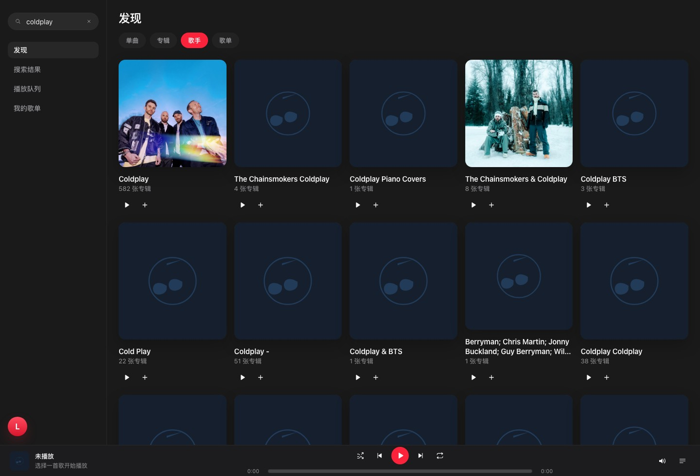
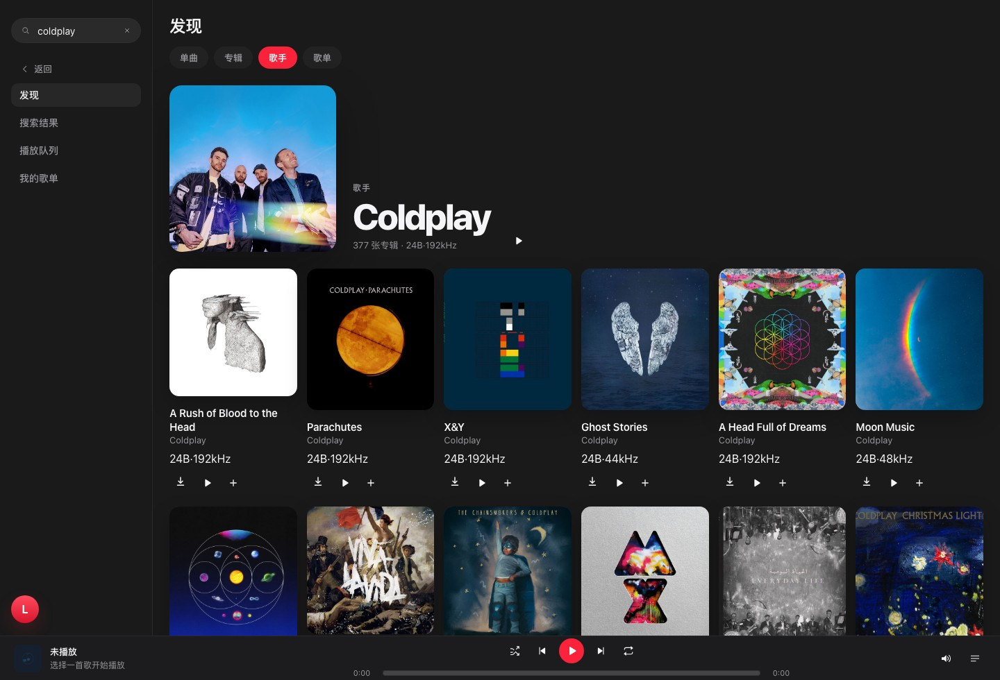
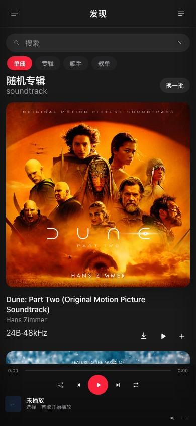
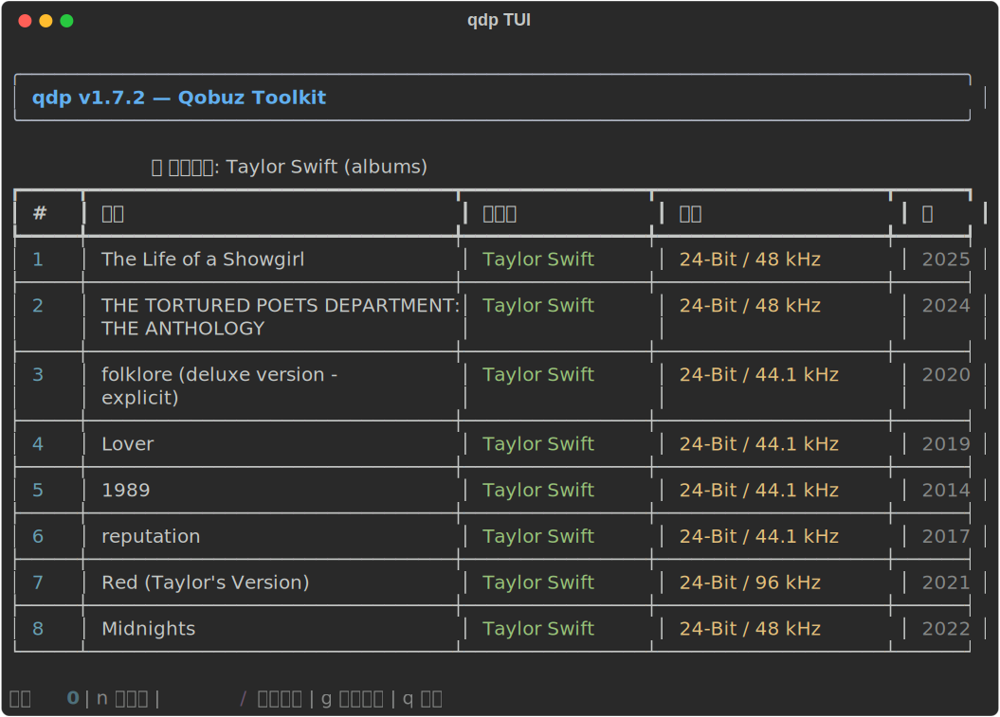

# qdp

qdp is a local Qobuz toolkit with an existing CLI/TUI downloader workflow and a local web player runtime.

Sprint 1 establishes the delivery baseline by documenting scope, backup rules, runnable commands, and packaging metadata.

## What is in this repository
- CLI entrypoint: `qdp/__main__.py` and `qdp/cli.py`
- Interactive UI/TUI: `qdp/ui.py`
- Account management: `qdp/accounts.py`
- Local web player server: `qdp/web/server.py`
- Browser app assets: `qdp/web/app/`
- Automated tests: `tests/`
- Packaging files: `setup.py`, `qdp.spec`, `build_windows.*`

## Requirements
- Python 3.9+
- pip
- Qobuz account credentials/config available locally

## Install
Create a virtual environment and install runtime dependencies:

```bash
python3 -m venv .venv
source .venv/bin/activate
python -m pip install --upgrade pip setuptools wheel
python -m pip install -r requirements.txt
python -m pip install -e . --no-build-isolation
```

## Environment / Credentials
Example variables are in `.env.example`.

The current application also reads account/config data from the local qdp config flow, especially for authenticated web-player actions.

## Run
### CLI / TUI
```bash
qdp
```

or

```bash
python -m qdp
```

First-time setup:

```bash
qdp -r
```

The config wizard will guide you through login method, key selection (default Android key / auto-fetch web key / manual App ID & Secret), download directory, and quality preference.

### Quick commands
```bash
qdp -s "query"          # search all
qdp -sa "album name"    # search albums
qdp -st "track name"    # search tracks
qdp "https://www.qobuz.com/album/xxxxx"  # download from URL
qdp --version            # show version (114.0.1)
qdp --help               # show help (works without config)
```

### Web player
```bash
python3 -m qdp.web.server
```

The server prints a listening URL such as `QDP web server listening on http://127.0.0.1:17890/` and keeps running until you stop it.

A reproducible local smoke sequence for the backend runtime is:

```bash
curl -i http://127.0.0.1:17890/
curl -i http://127.0.0.1:17890/app/
curl -i http://127.0.0.1:17890/nope
curl -i http://127.0.0.1:17890/stream
curl -i 'http://127.0.0.1:17890/api.json/0.2/test?x=1'
python3 scripts/webplayer_smoke.py --json
python3 -m pytest -q tests/test_web_server_runtime.py tests/test_web_player_frontend_contract.py tests/test_webplayer_smoke_cli.py
```

`webplayer_smoke.py` defaults to auto-starting a local Web Player, and also supports:
- `python3 scripts/webplayer_smoke.py --json` — auto-start + machine-readable JSON output
- `python3 scripts/webplayer_smoke.py --base-url http://127.0.0.1:17890 --no-start` — reuse an existing server instance
- `python3 scripts/webplayer_smoke.py --base-url http://127.0.0.1:17890 --no-start --json` — reuse an existing instance with stable JSON output

Expected results:
- `/` redirects to `/app/`
- `/app/` returns `200`
- `/nope` returns `404`
- `/stream` without `url` returns `400`
- `/api.json/0.2/test?x=1` returns `200` and JSON describing the active proxy/runtime contract
- `webplayer_smoke.py --json` returns parseable JSON and validates runtime version consistency, core API routes, stream proxy behavior, and the frontend DOM contract

### Proxy Configuration

Add a `proxies` field in `~/.config/qobuz-dl/config.ini` (or via the config wizard):

```ini
[DEFAULT]
proxies = https://proxy1.example.com,https://proxy2.example.com
```

Downloads and API requests automatically rotate through proxies. Falls back to direct connection if all proxies fail.

### Bundle / Web Key

The `bundle.py` module fetches Qobuz web keys. Default upstream is `play.qobuz.com` (official). Set `QDP_BUNDLE_URL` env var to use a custom mirror.

Supported runtime environment variables:
- `QDP_WEB_HOST` — bind host for the local HTTP server
- `QDP_WEB_PORT` — bind port for the local HTTP server
- `QDP_BUNDLE_URL` — custom Qobuz mirror URL for web key fetching
- `QDP_APP_ID` or `QOBUZ_APP_ID` — Qobuz application ID used by proxy routes
- `QDP_AUTH_TOKEN`, `QOBUZ_AUTH_TOKEN`, or `QOBUZ_USER_AUTH_TOKEN` — auth token forwarded to authenticated Qobuz API calls
- `QDP_USER_AGENT` or `QOBUZ_USER_AGENT` — user agent used for upstream API, asset, and stream requests
- `QDP_USE_TOKEN` or `QOBUZ_USE_TOKEN` — optional token-mode override

## Test
Run the existing automated test suite from the repository root:

```bash
pytest -q
```

The repository now ships `pytest.ini` so backup folders are not collected as tests.

Local-only build outputs and caches such as `build/`, `dist/`, `__pycache__/`, `.pytest_cache/`, and virtualenv directories should not be committed; they are safe to regenerate during local packaging or test runs.

If pytest is not installed yet:

```bash
python -m pip install -r requirements-build.txt
pytest -q
```

## Packaging
Install build dependencies:

```bash
python -m pip install -r requirements-build.txt
```

Build with PyInstaller:

```bash
python -m PyInstaller --clean --noconfirm qdp.spec
```

Preferred portable helper (works on Unix-like shells and auto-detects `python3` when `python` is unavailable):

```bash
./build_windows.sh
```

The helper now:
- creates an isolated `.venv-build` virtual environment
- installs runtime and build dependencies
- runs `python -m PyInstaller --clean --noconfirm qdp.spec`
- verifies that `dist/qdp/qdp`, `dist/qdp/qdp.exe`, or legacy flat `dist/qdp(.exe)` exists
- smoke-checks the artifact with `--help` before declaring success

Platform helpers:
- `build_windows.bat`
- `build_windows.ps1`
- `build_windows.sh`

## Project Docs
- Product spec: `docs/PRD.md`
- Backup strategy: `docs/backup-and-restore.md`
- Definition of done: `docs/definition-of-done.md`


## Webapp Maintenance

The web-facing layer now has a dedicated maintenance note:
- `docs/webapp-maintenance.md`

This area is mainly aligned with Kerry's contribution scope: web UI, browser interaction, and frontend-facing maintainability.


## Webapp Demo

- Live demo: https://b2ab7e62.qdp-webapp-demo.pages.dev
- Deployment URL: https://b2ab7e62.qdp-webapp-demo.pages.dev
- Latest UI: v2.13.0 (refresh-safe app routes, mobile search chips, search history, artist-page multi-breakpoint cleanup)
- Last refreshed: 2026-06-15

### Webapp Preview

Desktop search route with persistent URL and restored artist results:



Artist detail with back navigation, sticky paging info, and denser album grid:



Mobile search now has its own visible search box and focus-triggered type chips:



### TUI Preview




## Maintained By

- **Lingion**: mainline integration, infrastructure, deployment, and repository quality
- **Kerry1020**: webapp, UI, browser-side behavior, and frontend-facing maintenance

> Repository: `lingion/qdp` is the canonical repository. `Kerry1020/qdp` is kept in lockstep as a mirror. Kerry1020 is a collaborator with write access.
